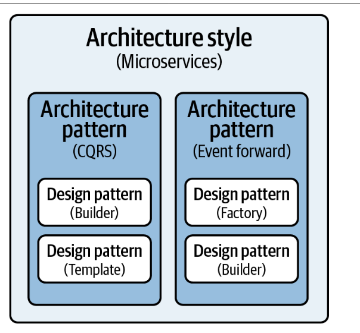

Difference between Low Level Design (LLD) and High Level Design (HLD)

# Introduction
- It’s all too common for developers to start coding an application
without a formal architecture in place
- This practice usually results
in ill-defined components, creating what is commonly referred to
as a big ball of mud.
- These architectures are generally tightly cou‐pled, brittle, difficult to change, and lack a clear vision or direction.
- It’s also very difficult to determine the architectural characteristics of applications lacking a well-defined architectural style. 
- - Does the architecture scale? 
- - What are the performance characteristics of the
application? 
- - How easy is it to change the application or add new features?
- - How responsive is the architecture?

## Why Architectures?
- Architecture styles help define the basic characteristics and behavior
of an application.
- Some architecture styles naturally lend themselves toward highly scalable systems, whereas other architecture styles naturally lend themselves toward applications that allow develop‐ers to respond quickly to change.
- Knowing the characteristics, strengths, and weaknesses of each architecture style is necessary to choose the one that meets your specific business needs and goals.

## Difference between Archicture Style and Architecture Pattern
- An architecture style, describes the macro structure of a system
- Architecture patterns describe reusable structural building block patterns
that can be used within each of the architecture styles to solve a par‐
ticular problem.
- - Architecture patterns differ from design patterns
- - - An architecture pattern impacts the structural aspect of a system
- - - A design pattern impacts how the source code is designed
- - - Architecture styles can be composed of architecture pat‐
terns, which in turn can be composed of design patterns. For example, you can use the
Builder design pattern as a way to implement the CQRS architecture
pattern, and then use the CQRS pattern as a building block within
a microservices architecture.

- - - 

- - Design patterns and architecture patterns are typically combined to
form a complete solution
- - Architecture styles can also be combined when building software solutions to form a complete solution

# Architecture Classification
### Monolithic Architectures:
- Monolithic architecture styles are much simpler than distributed ones, and as such are easier to design and implement
- These single deployment unit applications are fairly inexpensive from an overall cost standpoint
- Most applications architected using a monolithic architecture style can be developed and deployed much more quickly than distributed
ones
### Distributed Architectures: 

# Architecture
The web app architecture of a system describes its major components, their relationships, and how they interact with each other.

- Client Server architecture (Client -> Server -> Database)
- Peer to Peer Architecture (No need for central server)
- Monolothic Architecture (Not scalable, not reliable, with single point of failure.)
- Webservice Architecture
- Serverless Architecture (aka Function as a service. Functions are hosted by a thirdpart e.g aws lambda functions, azure functions, firebase cloud functions e.t.c)
- Hybrid architecture styles are common in the real world because not every architecture style can solve every busi‐ness problem. e.g
- - Event-driven microservices (events between microservices)
- - Space-based microservices (processing units implemented as microservices)
- - Event-driven microkernel architecture (events between the
core system and remote plug-in components).
- - Although forming
hybrids is a common practice, it is vital to understand individ‐
ual architecture styles and their corresponding strengths and weak‐
nesses before combining them.

# Software Architecture styles
- Data-centered architectures
- Data-flow architectures
- Call and return architectures
- Object-oriented architectures
- Layered architectures

-----------------------------
# System Requirements
Functional and non-functional requirements

# Design Principles
Design principles are guiding rules and concepts that inform the process of designing software systems
Applying design principles such as modularity, separation of concerns, abstraction,
and encapsulation to create a scalable and maintainable system.
- Separation of Concerns
- Command Query Separation (CQS)
- Inversion of Control
- Orthogonality: Things that are not related conceptually should not be related in the system
- Murphy's Law:  a universal law that when there is even the smallest possibility of something going wrong, it eventually will go wrong
- Maximise Cohesion: Since higher cohesion is better, group all related functionalities sharing a single responsibility (e.g. in a class)
- Single Responsibility Principle (SRP): Each class or module should have only one reason to change. It emphasizes that a class should have a single responsibility or purpose,   making  it easier to understand, maintain, and test.
- Open/Closed Principle (OCP)
- Liskov Substitution Principle (LSP)
- Composition Over Inheritance: Using inheritance, subclasses easily make assumptions, and break LSP.
- Interface Segregation Principle (ISP)
- Dependency Inversion Principle (DIP)
- Don't Repeat Yourself (DRY)
- Keep It Simple, Stupid (KISS
- Composition over Inheritance
- Law of Demeter (LoD)
- Avoid Premature Optimization: It is unknown upfront where the bottlenecks will be.After optimization, it might be harder to read and thus maintain

# Architectural Patterns
Architectural patterns provide a high-level design framework for organizing and structuring software systems.
They define the overall structure, behavior, and interaction between major components of a system.

- Master-slave architecture

- Shared-nothing architecture

- Layered Architecture

- Client-Server Architecture

- Microservices Architecture (https://microservices.io/)
- Event-Driven Architecture
- Service-Oriented Architecture (SOA)
- Model-View-Controller (MVC)
- Repository Pattern
- Pipe and Filter Architecture
- Publish-Subscribe Architecture
- Monolithic Architecture

# Component and Module Design
Identifying the key components or modules of the system and defining their responsibilities, interfaces, and interactions.

# Data Management
Designing the data storage and retrieval mechanisms, including databases, caching strategies, data models, and access patterns.

- **Database Design**: Understand the principles of database design, including normalization, indexing, and schema optimization. Design your database schema to support scalability and performance requirements.

- **Database Models**: Learn about different database models such as relational databases, NoSQL databases, and NewSQL databases. Understand their strengths, weaknesses, and use cases to choose the most suitable model for your application.

- **Replication and Sharding**: Explore database replication techniques to improve availability and fault tolerance. Learn about database sharding to horizontally partition your data across multiple nodes, enabling scalability and distributed processing.

- **Query Optimization**: Gain knowledge of query optimization techniques to improve the efficiency of database queries. Understand how to create efficient indexes, use query hints, and analyze query execution plans.

- **Caching**: Learn about caching strategies to reduce database load and improve response times. Explore technologies like in-memory caches, content delivery networks (CDNs), and distributed caches.

- **Data Partitioning**: Understand data partitioning techniques to distribute your data across multiple servers or clusters. Horizontal partitioning, vertical partitioning, and functional partitioning are common approaches to handle large datasets.

- **Distributed Database Systems**: Study distributed database systems that provide scalability and high availability. Learn about technologies like Apache Cassandra, Apache HBase, Google Bigtable, and Amazon DynamoDB.

- **Data Consistency and Integrity**: Understand the challenges of maintaining data consistency and integrity in distributed systems. Learn about techniques like distributed transactions, eventual consistency, and conflict resolution.

- **Database Monitoring and Performance Tuning**: Acquire skills in monitoring and optimizing database performance. Learn how to use database monitoring tools, analyze performance metrics, identify bottlenecks, and tune database configurations.

- **Scalability and High Availability**: Explore techniques for scaling databases horizontally and vertically. Learn about replication, load balancing, failover, and disaster recovery strategies to ensure high availability and reliability.

# Integration and Communication
Determining how different components or services will communicate and integrate with each other,
including choosing appropriate communication protocols and data formats.

Here are some key considerations when addressing integration and communication:

- **Communication Protocols**: Selecting the appropriate communication protocols based on the system's requirements and constraints. This includes considering factors such as performance, security, reliability, and compatibility. Common protocols include HTTP(S), REST, gRPC, MQTT, AMQP, and WebSocket.

- **Data Formats and Serialization**: Defining the data formats used for communication between components. This involves choosing formats like JSON, XML, Protocol Buffers, or Apache Avro, as well as determining the serialization and deserialization mechanisms.

- **API Design**: Designing well-defined APIs (Application Programming Interfaces) for the components or services to expose their functionality and interact with each other. This includes deciding on the structure, endpoints, request/response formats, and authentication/authorization mechanisms.

- **Event-Driven Architecture**: Implementing event-driven communication patterns where components communicate through events or messages. This allows for loose coupling and asynchronous communication, facilitating scalability, extensibility, and fault tolerance. Technologies like message queues, publish/subscribe systems, and event-driven frameworks can be utilized.

- **Synchronous vs. Asynchronous Communication**: Choosing between synchronous and asynchronous communication mechanisms based on the system's requirements. Synchronous communication provides immediate responses but may introduce latency, while asynchronous communication allows components to work independently and decoupled from each other.

- **Integration Patterns**: Applying integration patterns, such as publish/subscribe, request/reply, or message transformation, to address specific integration scenarios. These patterns help in managing the flow and transformation of data between components.

- **Security and Authorization**: Incorporating secure communication practices, including encryption, authentication, and authorization mechanisms, to protect sensitive data and ensure authorized access to services and APIs.

- **Error Handling and Exception Management**: Defining strategies for handling communication errors, exceptions, and failures. This includes implementing appropriate error codes, retry mechanisms, and fault tolerance mechanisms to ensure system stability and resilience.

- **Monitoring and Logging**: Instrumenting the communication channels and components to capture relevant metrics, logs, and events. This enables effective monitoring, troubleshooting, and performance optimization.

- **Integration Testing**: Conducting thorough integration testing to validate the interactions and communication between components, ensuring proper functioning and compatibility.

## Communication Protocols

- **HTTP(S)**: Hypertext Transfer Protocol (HTTP) is the foundation of communication on the web. It enables communication between clients (such as web browsers) and servers. HTTP is stateless and supports various methods like GET, POST, PUT, and DELETE. HTTPs adds a layer of encryption and security through SSL/TLS.

- **REST**: Representational State Transfer (REST) is an architectural style that uses HTTP as the communication protocol. It emphasizes using standard HTTP methods and URLs to interact with resources. REST APIs are widely used for web services and are language-agnostic.

- **GraphQL**: GraphQL is an open-source query language and runtime for APIs. It provides a flexible and efficient approach to data fetching and manipulation. Unlike REST, GraphQL allows clients to specify the exact data requirements, reducing over-fetching or under-fetching of data.

- **WebSocket**: WebSocket is a communication protocol that provides full-duplex communication channels over a single TCP connection. It enables real-time, bidirectional communication between clients and servers, allowing for instant data updates and push notifications.

- **Message Queuing Protocols**: Protocols like AMQP (Advanced Message Queuing Protocol), MQTT (Message Queuing Telemetry Transport), and Apache Kafka Protocol are used for asynchronous messaging and event-driven architectures. They provide reliable message delivery, publish-subscribe messaging, and decoupling of components.

- **gRPC**: gRPC is a high-performance, open-source framework developed by Google. It uses Protocol Buffers (protobuf) as the interface definition language and supports multiple programming languages. gRPC enables efficient communication between microservices using binary serialization and HTTP/2 for transport.

- **TCP/IP**: Transmission Control Protocol/Internet Protocol (TCP/IP) is the fundamental protocol suite for communication on the internet. It provides reliable, connection-oriented communication between devices over IP networks.

# Security
Addressing security concerns by designing authentication, authorization, and data protection mechanisms.
Security is a critical aspect of software architecture. When addressing security concerns, several factors need to be considered:

- **Authentication**: Designing an authentication mechanism to verify the identity of users or components accessing the system. This may involve implementing techniques such as username/password authentication, two-factor authentication (2FA), or integration with external identity providers like OAuth or SAML.

- **Authorization**: Establishing authorization mechanisms to control access to resources based on the authenticated user's privileges. This can be achieved through role-based access control (RBAC), access control lists (ACLs), or attribute-based access control (ABAC) models. It's important to ensure that only authorized users have access to sensitive data and functionalities.

- **Data Protection**: Implementing measures to protect data in transit and at rest. This includes using secure communication protocols like HTTPS or TLS for data transmission, encrypting sensitive data stored in databases or files, and implementing secure storage mechanisms. Techniques such as hashing, encryption, and tokenization can be employed to safeguard data integrity and confidentiality.

- **Input Validation**: Ensuring that all user inputs are properly validated and sanitized to prevent common security vulnerabilities like SQL injection, cross-site scripting (XSS), or command injection attacks. Input validation should be performed at various layers of the system, including user interfaces, server-side components, and database interactions.

- **Security Testing**: Conducting regular security assessments, vulnerability scans, and penetration testing to identify potential weaknesses in the system. This helps in identifying security vulnerabilities or misconfigurations that could be exploited by attackers. Security testing should be an integral part of the development process to ensure that security controls are effective.

- **Compliance and Regulations**: Adhering to industry-specific security standards and regulations, such as PCI-DSS for payment systems or HIPAA for healthcare applications. Understanding and complying with applicable regulations ensures the system meets the required security standards and protects sensitive user data.

# Performance
Optimizing system performance through efficient algorithms, caching, load balancing, and scalability strategies.
To address performance in a modern architecture, several strategies can be employed to optimize system performance and ensure efficient operation. Here are some key considerations:

- **Efficient Algorithms**: Design and implement algorithms that are optimized for performance. Analyze the computational complexity of algorithms and choose the most efficient ones for handling critical operations. Utilize data structures and algorithms that provide fast access, retrieval, and manipulation of data.

- **Caching**: Implement caching mechanisms to store frequently accessed data or compute-intensive results. Use in-memory caches like Redis or Memcached to reduce latency and improve response times. Employ caching strategies such as content caching, query result caching, or session caching to minimize redundant processing and network round trips.

- **Load Balancing**: Distribute incoming requests across multiple servers or instances to distribute the workload and prevent overloading a single component. Use load balancers to evenly distribute traffic and ensure optimal resource utilization. Employ techniques such as round-robin, least connections, or weighted algorithms for load balancing.

- **Scalability Strategies**: Design the architecture to scale horizontally by adding more instances or nodes to handle increased load. Utilize technologies like containerization with Docker and orchestration with Kubernetes to easily scale and manage application instances. Implement auto-scaling mechanisms that automatically adjust resources based on demand.

- **Performance Monitoring and Optimization**: Set up monitoring and profiling tools to identify performance bottlenecks and areas for optimization. Monitor system metrics such as response times, resource utilization, and throughput to detect anomalies and optimize performance. Use performance profiling tools to identify code-level or database-level optimizations.

- **Database Optimization**: Optimize database performance by properly indexing tables, optimizing queries, and employing database-specific optimizations. Analyze query performance and identify slow queries that can be optimized through query tuning or schema redesign. Consider database caching techniques to reduce database load.

- **Asynchronous Processing**: Utilize asynchronous processing for time-consuming or non-blocking tasks. Offload resource-intensive or long-running operations to background processes or queues to free up resources and improve responsiveness. Use message queues or event-driven architectures to enable asynchronous communication and parallel processing.

- **Network Optimization**: Optimize network performance by minimizing network round trips, reducing data transfer sizes, and implementing efficient protocols. Employ techniques such as compression, request bundling, or data aggregation to reduce network overhead. Utilize content delivery networks (CDNs) to cache and serve static assets closer to users.

- **Performance Testing and Benchmarking**: Conduct performance testing to measure and validate system performance under various load conditions. Use load testing tools to simulate high traffic scenarios and identify performance bottlenecks. Benchmark system performance against defined targets or industry standards to ensure optimal performance.

- **Continuous Performance Optimization**: Make performance optimization an ongoing process by continuously monitoring, analyzing, and improving system performance. Regularly review system architecture, algorithms, and codebase to identify areas for optimization. Utilize performance profiling, A/B testing, and performance regression testing to ensure consistent performance improvements.

# Deployment and Infrastructure
Planning the deployment architecture, including the selection of deployment platforms,
cloud services, containerization, and managing system dependencies.
Deployment and infrastructure planning play a crucial role in the successful implementation of a modern architecture. Here are some considerations for this aspect:

- **Deployment Platforms**: Choose appropriate deployment platforms based on the specific requirements of the application. Consider options such as cloud infrastructure providers (e.g., AWS, Azure, Google Cloud) or on-premises infrastructure. Evaluate factors like scalability, availability, cost, and geographic coverage when selecting deployment platforms.

- **Cloud Services**: Leverage cloud services to offload infrastructure management and focus on application development. Utilize services like serverless computing (AWS Lambda, Azure Functions), managed databases (AWS RDS, Azure SQL Database), and messaging systems (AWS SNS/SQS, Azure Service Bus) to handle specific functionalities. This allows for scalability, reduced maintenance efforts, and cost optimization.

- **Containerization**: Use containerization technologies like Docker to package applications along with their dependencies. Containers provide consistency and portability across different environments, making it easier to deploy and manage applications. Container orchestration tools like Kubernetes help automate deployment, scaling, and management of containerized applications.

- **Infrastructure as Code (IaC)**: Adopt Infrastructure as Code practices to define and manage infrastructure resources programmatically. Tools like Terraform or AWS CloudFormation enable infrastructure provisioning and configuration through code, ensuring reproducibility, version control, and scalability. IaC simplifies the deployment process and facilitates infrastructure updates and maintenance.

- **Continuous Integration and Continuous Deployment (CI/CD)**: Implement CI/CD pipelines to automate the build, test, and deployment processes. Use tools like Jenkins, GitLab CI/CD, or AWS CodePipeline to streamline the delivery of new features and updates. CI/CD pipelines ensure consistent deployments, facilitate testing, and enable rapid iteration and feedback.

- **High Availability and Fault Tolerance**: Design deployment architectures that ensure high availability and fault tolerance. Utilize load balancers, auto-scaling, and redundancy mechanisms to distribute traffic and handle failures. Implement multi-region deployments and disaster recovery strategies to ensure business continuity in case of failures or outages.

- **Monitoring and Logging**: Set up robust monitoring and logging solutions to gain insights into the performance and health of the deployed system. Use tools like Prometheus, Grafana, or AWS CloudWatch to monitor key metrics, track errors, and troubleshoot issues. Implement centralized logging to aggregate and analyze logs for better visibility.

- **Security and Compliance**: Consider security best practices and compliance requirements during deployment planning. Implement security measures such as network isolation, encryption, access controls, and regular security audits. Ensure compliance with relevant regulations and standards like GDPR or HIPAA, depending on the application domain.

- **Infrastructure Scalability**: Design the infrastructure to scale horizontally to handle increased workloads. Implement auto-scaling mechanisms based on metrics like CPU utilization or request rates. Leverage cloud services like AWS Elastic Load Balancer, Azure Load Balancer, or Kubernetes Horizontal Pod Autoscaler to automatically adjust resources based on demand.

- **Dependency Management**: Manage system dependencies and ensure consistent deployment of required libraries, frameworks, and third-party components. Utilize dependency management tools like npm (Node.js), pip (Python), or Maven (Java) to manage and version dependencies. Consider using container images or package managers for efficient dependency management.

# Testing and Quality Assurance
Defining the testing strategies and quality assurance processes to ensure the system meets the functional and non-functional requirements.

# Documentation and Communication
Documenting the architectural decisions, design rationale, and system documentation.
Communicating the architecture to stakeholders, development teams, and other relevant parties.
